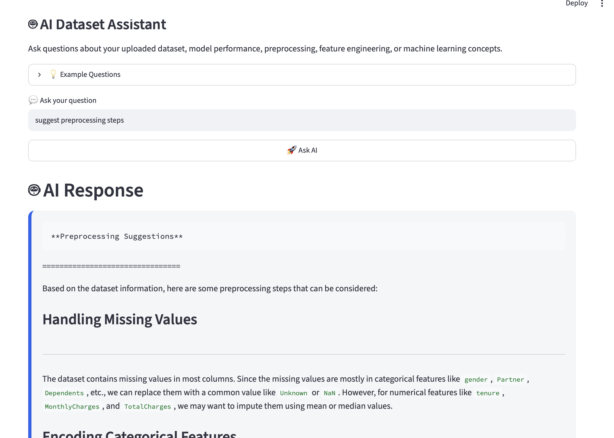

# 🧠 Insight AutoML

> AI-Powered Machine Learning & Data Analytics Platform built with Streamlit, FastAPI, Scikit-learn and Ollama.


## 🚀 Overview

Insight AutoML is an end-to-end machine learning platform that allows users to upload datasets, automatically train multiple machine learning models, compare their performance, perform Exploratory Data Analysis (EDA), and interact with an AI-powered dataset assistant using Ollama.

The project is designed to simplify the machine learning workflow while providing an intuitive interface for students, researchers, and data analysts.


# ✨ Features---

- 📂 Upload CSV datasets
- 📊 Automatic Exploratory Data Analysis (EDA)
- 🎯 Target column selection
- 🤖 Train multiple Machine Learning models
- 🏆 Automatic best model selection
- 📈 Interactive model comparison
- 📉 Accuracy visualization
- 💬 AI Dataset Assistant (Powered by Ollama)
- 📥 Download model performance results
- ⚡ FastAPI backend
- 🎨 Modern Streamlit interface


#  🛠 Tech Stack

## Frontend
- Streamlit

## Backend
- FastAPI

## Machine Learning
- Scikit-learn
- Pandas
- NumPy

## AI
- Ollama (Llama 3)

## Visualization
- Plotly
- Matplotlib
- Seaborn


# 📂 Project Structure


InsightAI-AutoML
│
├── backend
│   ├── api
│   ├── services
│   ├── ml
│   └── main.py
│
├── frontend
│   ├── app.py
│   ├── header.py
│   ├── sidebar.py
│   └── eda.py
│
├── datasets
├── models
├── reports
├── screenshots
│
├── requirements.txt
├── README.md
└── .gitignore


## ⚙️ Installation

# Clone Repository

```bash
git clone https://github.com/nikhilbhargav8887/InsightAI-AutoML.git

cd InsightAI-AutoML
```

# Create Virtual Environment

```bash
python -m venv venv
```

# Activate Environment

Mac/Linux

```bash
source venv/bin/activate
```

Windows

```bash
venv\Scripts\activate
```

# Install Dependencies

```bash
pip install -r requirements.txt
```


# ▶️ Run Backend

```bash
uvicorn backend.main:app --reload
```


# ▶️ Run Frontend

```bash
streamlit run frontend/app.py
```


# 🔄 Workflow


Upload Dataset
        │
        ▼
Dataset Preview
        │
        ▼
Exploratory Data Analysis
        │
        ▼
Train Multiple ML Models
        │
        ▼
Compare Performance
        │
        ▼
Select Best Model
        │
        ▼
Ask AI Dataset Assistant
        │
        ▼
Download Results


## 🤖 AI Dataset Assistant

The application integrates **Ollama** to provide an intelligent AI assistant capable of answering questions related to:

- Dataset structure
- Missing values
- Feature engineering
- Model performance
- Machine Learning concepts
- Preprocessing recommendations


## 📊 Machine Learning Models

The platform currently supports:

- Logistic Regression
- Random Forest
- Decision Tree
- KNN
- Support Vector Machine (SVM)


## 📸 Screenshots


## 🏠 Home Page


---

## 📊 Exploratory Data Analysis


---

## 🏆 Model Training & Comparison


---

## 🤖 AI Dataset Assistant



---

## 📈 Accuracy Comparison


# 🎯 Future Improvements

- XGBoost & LightGBM integration
- Hyperparameter tuning
- SHAP Explainability
- Power BI Dashboard Integration
- Tableau Dashboard Integration
- Cloud Deployment
- User Authentication
- Model Persistence


# 👨‍💻 Author

 Nikhil Tripathi

 Engineering Student.....

 Passionate about

- Data Analytics
- Data Science
- Machine Learning
- Generative AI

GitHub:
https://github.com/nikhilbhargav8887


 ⭐ Support

If you found this project useful, consider giving it a ⭐ on GitHub!!!

## 📜 License

This project is licensed under the MIT License.
