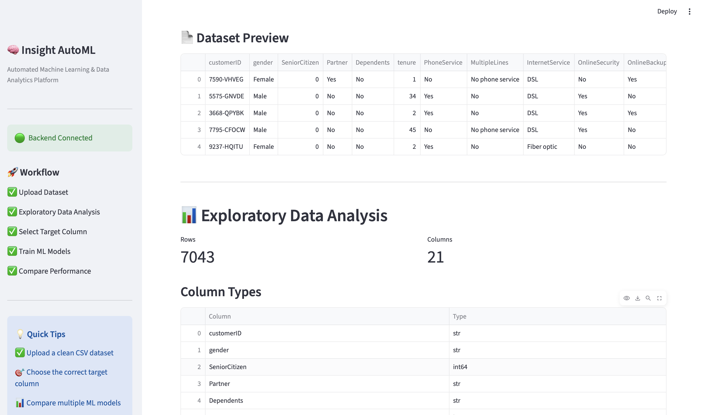
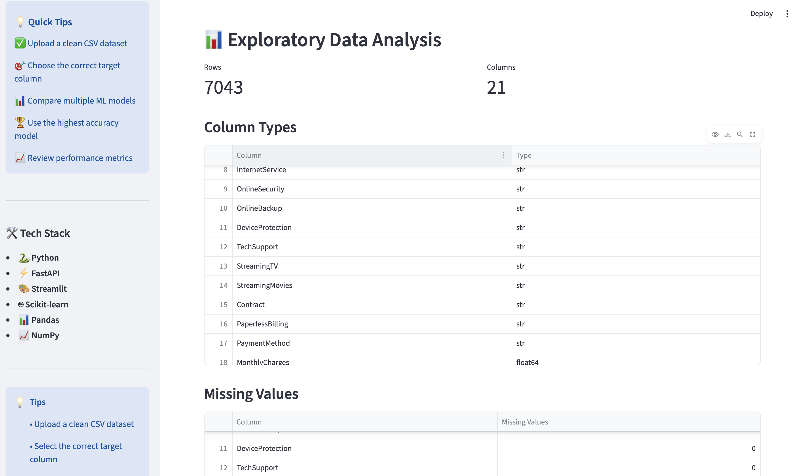
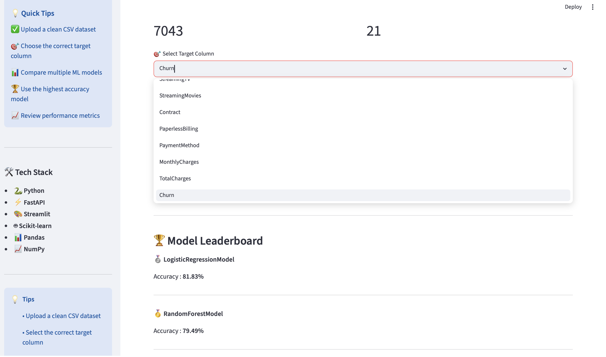
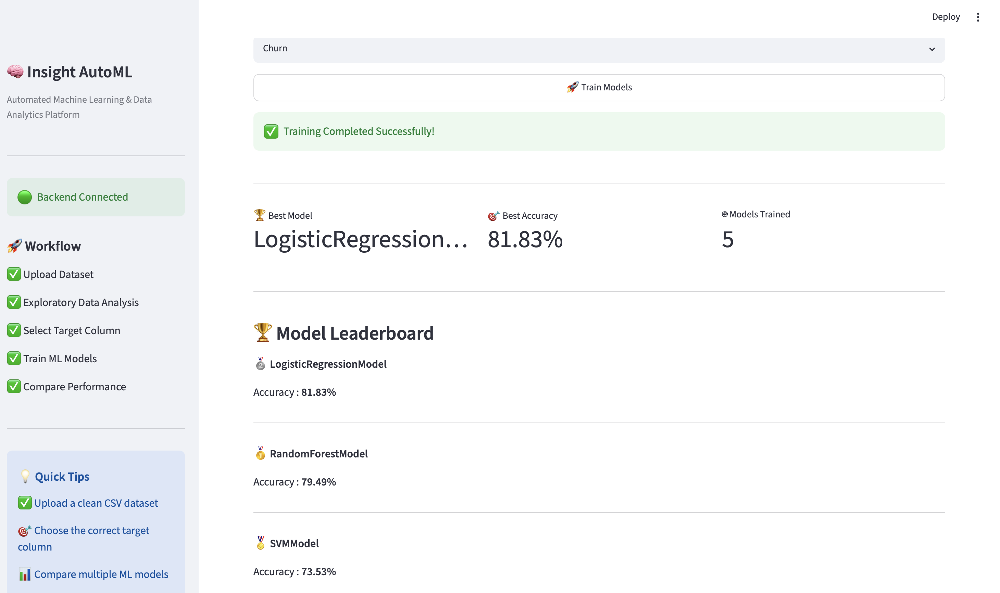
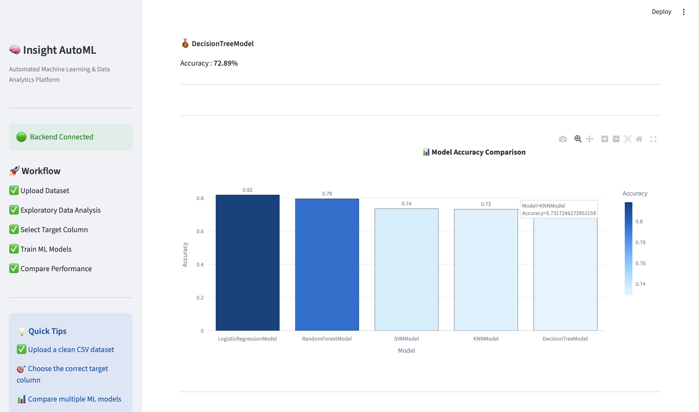
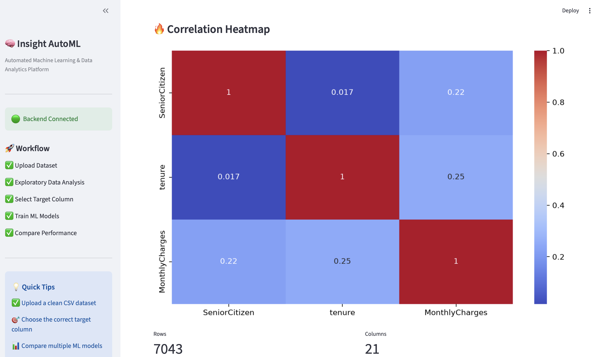

# 🧠 Insight AutoML

> 🚀 An end-to-end Machine Learning platform that automates dataset analysis, exploratory data analysis (EDA), model training, evaluation, and visualization through an interactive web interface.


# 🌐 Live Demo

### 🔗 Frontend

https://insightai-automl-frontend.onrender.com

### 🔗 Backend API

https://insightai-automl.onrender.com


# 📌 Overview

Insight AutoML is an end-to-end Machine Learning platform that simplifies the complete ML workflow. Users can upload CSV datasets, perform Exploratory Data Analysis (EDA), train multiple machine learning models, compare their performance, and identify the best-performing model through an intuitive web interface.

The project is designed for students, data analysts, and machine learning enthusiasts who want to automate repetitive ML tasks while learning the complete machine learning pipeline.


# ✨ Features

- 📂 Upload CSV datasets
- 📊 Automatic Dataset Preview
- 📈 Exploratory Data Analysis (EDA)
- 📉 Correlation Heatmap
- 📋 Missing Value Analysis
- 🎯 Target Column Selection
- 🤖 Train Multiple Machine Learning Models
- 🏆 Automatic Best Model Selection
- 📊 Model Performance Comparison
- 📈 Accuracy Visualization
- 📥 Download Model Performance
- ⚡ FastAPI REST Backend
- 🎨 Interactive Streamlit Dashboard
- 🐳 Docker Support
- ☁️ Cloud Deployment on Render


# 🏗️ System Architecture

```text
                 User
                   │
                   ▼
        Streamlit Frontend
                   │
             REST API Calls
                   │
                   ▼
           FastAPI Backend
                   │
        Data Preprocessing
                   │
        Machine Learning Models
                   │
      Performance Evaluation
                   │
                   ▼
      Interactive Dashboard
```


# 🛠 Tech Stack

## Frontend

- Streamlit

## Backend

- FastAPI
- Uvicorn

## Machine Learning

- Scikit-learn
- Pandas
- NumPy
- SciPy

## Visualization

- Plotly
- Matplotlib
- Seaborn

## Deployment

- Docker
- Docker Compose
- Render

## Version Control

- Git
- GitHub


# 📂 Project Structure

```
InsightAI-AutoML
│
├── backend/
├── frontend/
├── datasets/
├── models/
├── reports/
├── screenshots/
│
├── Dockerfile.backend
├── Dockerfile.frontend
├── docker-compose.yml
├── .dockerignore
│
├── requirements.txt
├── README.md
├── LICENSE
└── .gitignore
```


# ⚙️ Installation

## Clone Repository

```bash
git clone https://github.com/nikhilbhargav8887/InsightAI-AutoML.git

cd InsightAI-AutoML
```

## Create Virtual Environment

```bash
python -m venv venv
```

### Mac/Linux

```bash
source venv/bin/activate
```

### Windows

```bash
venv\Scripts\activate
```

## Install Dependencies

```bash
pip install -r requirements.txt
```


# ▶️ Run Backend

```bash
uvicorn backend.main:app --reload
```


# ▶️ Run Frontend

```bash
streamlit run frontend/app.py
```


# 🐳 Docker

Build and run the complete application

```bash
docker compose up --build
```

Backend

```
http://localhost:8000
```

Frontend

```
http://localhost:8501
```


# 🔄 Machine Learning Workflow

```text
Upload Dataset
        │
        ▼
Dataset Preview
        │
        ▼
Exploratory Data Analysis
        │
        ▼
Target Selection
        │
        ▼
Train Multiple ML Models
        │
        ▼
Evaluate Performance
        │
        ▼
Compare Results
        │
        ▼
Select Best Model
        │
        ▼
Interactive Dashboard
```


# 📊 Machine Learning Models

The platform currently supports:

- Logistic Regression
- Decision Tree
- Random Forest
- Support Vector Machine (SVM)
- K-Nearest Neighbors (KNN)

---

# 📸 Screenshots

## Home


---

## Dataset Upload



---

## Exploratory Data Analysis



---

## Target Selection



---

## Model Training



---

## Model Comparison



---

## Leaderboard



# 🎯 Future Improvements

### 🤖 Artificial Intelligence

- Google Gemini Integration
- AI Dataset Insights
- Natural Language Data Analysis

### 📊 Machine Learning

- XGBoost
- LightGBM
- Hyperparameter Optimization

### 📈 Analytics

- SHAP Explainability
- PDF Reports
- Advanced Visualizations

### ☁️ Platform

- User Authentication
- Cloud Storage
- Model Versioning


# 👨‍💻 Author

**Nikhil Tripathi**


🔗 GitHub: https://github.com/nikhilbhargav8887

🔗 LinkedIn: https://www.linkedin.com/in/nikhil-tripathi-3795773b2/#:~:text=www.linkedin.com/in/nikhil%2Dtripathi%2D3795773b2


# 🤝 Contributing

Contributions, issues, and feature requests are welcome.

If you'd like to improve this project, feel free to fork the repository and submit a pull request.


# ⭐ Support

If you found this project useful, please consider giving it a ⭐ on GitHub.

It helps others discover the project and motivates future development.


# 📜 License

This project is licensed under the MIT License.